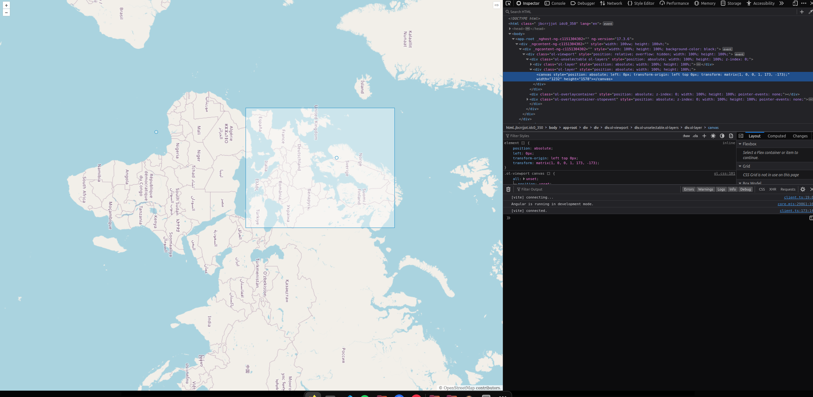
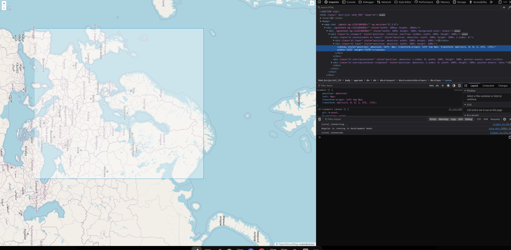
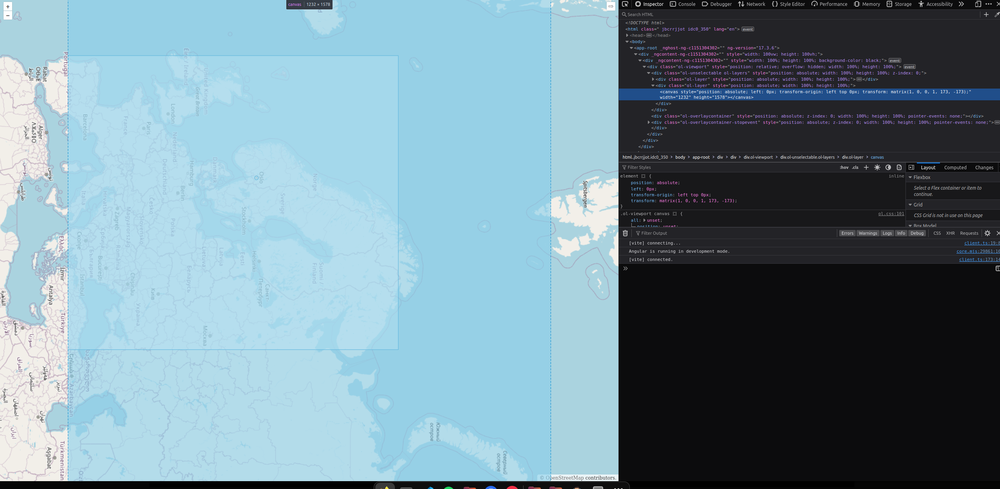

# Reproducing the bug
1. run `pnpm i` (or use npm if u want)
2. `npm start` and visit http://localhost:4200/

3. zoom in on the map so that the vectors come close to the left or right side of the canvas.
4. Make sure to be 90 degrees rotated for it to happend.

5. The canvas appears to both have wrong css tranformation, and also width and length.

6. This only happends with openlayers 9, and not with 8.2.0.
7. Run pnpm i ol@8.2.0 to see that the bug is not there.

## Tested on
- firefox 125.0.2 on Ubuntu 22.04
- Chrome 122 on Windows
- Built using ubuntu 22.04 with node v20.10.0 and v20.12.2 using angular@^17
